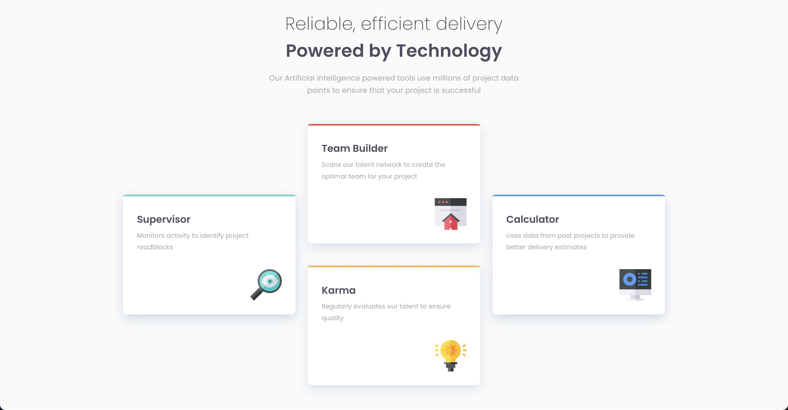

# Frontend Mentor - Four card feature section solution

This is a solution to the [Four card feature section challenge on Frontend Mentor](https://www.frontendmentor.io/challenges/four-card-feature-section-weK1eFYK). Frontend Mentor challenges help you improve your coding skills by building realistic projects.

## Table of contents

- [Overview](#overview)
  - [The challenge](#the-challenge)
  - [Screenshot](#screenshot)
  - [Links](#links)
  - [Built with](#built-with)
  - [What I learned](#what-i-learned)
  - [Continued development](#continued-development)
  - [Useful resources](#useful-resources)
- [Author](#author)

**Note: Delete this note and update the table of contents based on what sections you keep.**

## Overview

I developed a mobile-first, four-card feature section using the flexbox model. The cards expand into a row on desktop, with two list items centered along the main axis. Each list item features elliptical top borders and a bottom blurred shadow, creating a visually appealing and responsive design.

### The challenge

Users should be able to:

- View the optimal layout for the site depending on their device's screen size

### Screenshot



### Links

- Solution URL: [https://github.com/NikitaVologdin/four-card-feature-section](https://github.com/NikitaVologdin/four-card-feature-section)
- Live Site URL: [https://four-card-feature-section-eta-nine.vercel.app/](https://four-card-feature-section-eta-nine.vercel.app/)

### Built with

- Semantic HTML5 markup
- CSS custom properties
- Flexbox
- Mobile-first workflow

### What I learned

I gained a comprehensive understanding of the flexbox model along with the border-radius property's ability to create elliptical corners and the drop-shadow property's functionality for applying blurred shadows.

```css
border-top-left-radius: 10px 1%;

filter: drop-shadow(0px 8px 10px hsla(213, 47%, 67%, 0.4));
```

### Continued development

I going to deep dive into css grid layout

### Useful resources

- [An Interactive Guide to Flexbox](https://www.joshwcomeau.com/css/interactive-guide-to-flexbox/) - This helped me with detailed understanding of flex axis. Flex name properties now clear and convenient for me.
- [border-radius](https://developer.mozilla.org/en-US/docs/Web/CSS/border-radius) - This gave me understanding of how to use border-radius to display elliptical corner.

## Author

- Website - [Nikita Vologdin](https://vologdin.eu/portfolio)
- Frontend Mentor - [@NikitaVologdin](https://www.frontendmentor.io/profile/NikitaVologdin)
